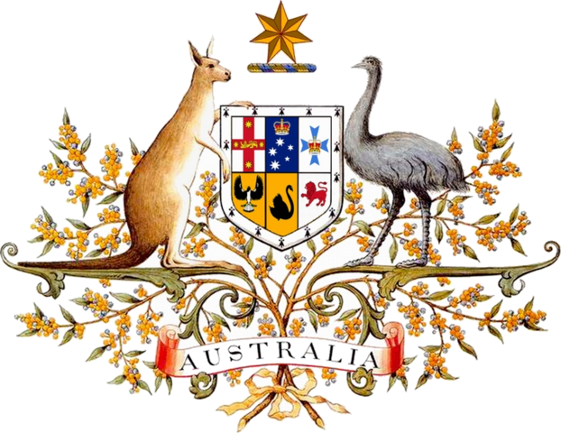
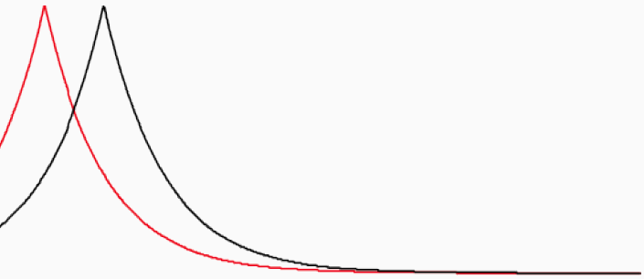
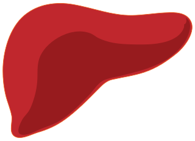

---
output:
  html_document:
    toc: true
    toc_float: true
    toc_depth: 4
---

```{r setup, include=FALSE}
knitr::opts_chunk$set(echo = TRUE)
```

<link rel="stylesheet" href="styles.css" type="text/css">

<br>

## Privacy \& Security

### 30yr Medicare/PBS dataset and the Re-identification Criminalisation Bill

<!--Public domain image source: https://commons.wikimedia.org/wiki/File:Medicare_brand.svg-->
 

With colleagues Teague and Culnane, I helped uncover one of the largest privacy breaches in Australian history 2016--17. Federal health and human services in mid-2016 released an open dataset of 30 years of Medicare and Pharmaceutical Benefits Schemes transaction records, for 10% of the Australian population. The intention was to drive health economics research, for evidence-based policy development. Unfortunately minimal privacy protections were in place, while the data reported sensitive treatments e.g., for AIDS, late-term abortions, etc. Initially we completely [reidentified doctors](https://pursuit.unimelb.edu.au/articles/understanding-the-maths-is-crucial-for-protecting-privacy), due to improper hashing of their IDs.  As a result the dataset was taken offline and a [public statement](http://www.health.gov.au/internet/main/publishing.nsf/Content/mr-yr16-dept-dept005.htm) released by the Department. It could not be recalled. A year later we [announced](https://pursuit.unimelb.edu.au/articles/the-simple-process-of-re-identifying-patients-in-public-health-records) we had [reidentified](https://arxiv.org/abs/1712.05627) patients such as well-known figures in Australian sport and politics.

<!--Public domain image source: https://commons.wikimedia.org/wiki/File:Australian_Coat_of_Arms.png-->
 

The day after Medicare's retraction, the Attorney General published a plan to [legislate against reidentification](https://www.attorneygeneral.gov.au/Mediareleases/Pages/2016/ThirdQuarter/Amendment-to-the-Privacy-Act-to-further-protect-de-identified-data.aspx) of Commonwealth datasets. In the months to come the _Reidentification Criminal Offence Bill_ (an amendment to the _Privacy Act 1988_) was introduced to Parliament criminalising the act of reidentification, unless [with](http://www.itnews.com.au/news/brandis-says-white-hats-will-be-exempt-from-data-law-changes-438496) [prior](http://www.canberratimes.com.au/national/public-service/government-appoints-information-watchdog-timothy-pilgrim-but-no-one-to-fill-top-privacy-foi-jobs-20160928-grqm9j.html) [permission](https://www.oaic.gov.au/media-and-speeches/statements/australian-privacy-commissioner-s-investigation-into-published-mbs-and-pbs-data-sets). The bill, if passed, would be retroactively applied and reverse the burden of proof on accused. While stifling security experts and journalists responsibly disclosing existing privacy breaches to the government, the bill would not prevent private corporations or foreign entities outside Australian jurisdiction from misusing Commonwealth data. Of 15 submissions to the ensuing Parliamentary Inquiry examining the appropriateness of the bill, 14 were against including the Law Council of Australia, Australian Bankers’ Association, and EFF.
Our [submission to the inquiry](http://www.aph.gov.au/Parliamentary_Business/Committees/Senate/Legal_and_Constitutional_Affairs/PrivacyReidentification/Submissions) achieved significant impact, being directly quoted 9 times in the Senate Committee’s final report. 
We wrote an [Op-Ed](http://www.smh.com.au/national/public-service/can-the-government-really-protect-your-privacy-when-it-deidentifies-public-data-20161204-gt3nny.html) in the Sydney Morning Herald clearly explaining [why](https://pursuit.unimelb.edu.au/articles/crime-and-privacy-in-open-data) criminalising reidentification would do more harm than good. Since then we have made several related submissions, including to the: [Data Sharing and Release Consultation 2018](https://www.pmc.gov.au/public-data/data-sharing-and-release-reforms/submissions) (file 20697), [Parliamentary Inquiry into the My Health Record System 2018](https://www.aph.gov.au/Parliamentary_Business/Committees/Senate/Community_Affairs/MyHealthRecordsystem/Submissions) (submission #59), [ACCC Consumer Data Right draft rules 2019](https://www.accc.gov.au/focus-areas/consumer-data-right-cdr-0/cdr-draft-rules-banking).

### Technical privacy assessments: ABS, ONS, Opal

 

Also with colleagues Culnane and Teague since 2016, I have contributed towards several technical privacy assessments of government data initiatives. Contracted by the [Australian Bureau of Statistics](http://www.abs.gov.au/) (ABS), we have [analysed the privacy](https://arxiv.org/abs/1802.07975) of several options for name encoding for private record linkage---as might be used for Australian Census data for example. For [Transport for NSW](https://www.transport.nsw.gov.au/), we have performed a technical [privacy assessment](https://arxiv.org/abs/1704.08547) of a Data61-processed dataset of Opal transport card bus, train, ferry touch ons/offs again under contract. The data has subsequently been published. We have also discovered vulnerabilities in the hashing methodology published by the [UK Office of National Statistics](https://www.ons.gov.uk/) in a third [privacy assessment](https://arxiv.org/abs/1712.00871) (explained [here](https://pursuit.unimelb.edu.au/articles/how-small-details-can-create-a-big-problem)). Common themes to this work are reflected in our 2018 [report](https://ovic.vic.gov.au/resource/protecting-unit-record-level-personal-information/) for the [Office of the Victorian Information Commissioner](https://www.cpdp.vic.gov.au).

### Promoting privacy through cheating at Kaggle

 

In 2011 with Narayanan (now Princeton)
and Shi (now Cornell), I helped demonstrate the power of privacy attacks to Kaggle (a $16m Series A, Google acquired platform for crowdsourcing machine learning) [[IJCNN'11](http://arxiv.org/abs/1102.4374)]. After determining the source of an anonymised social network dataset, intended for use
in a link prediction contest, we downloaded and linked it to the competition test set. Normally a linkage attack would
end there, having re-identified users. We used it to look up correct test answers and win the competition by ‘cheating’.
No privacy breach resulted and contestants remained able to compete. However the result raised awareness for Kaggle,
to the stark reality of privacy attacks. Team member Narayanan subsequently [consulted](http://randomwalker.info/publications/heritage-health-re-identifiability.pdf) on the privacy of the \$3m Heritage Health Prize dataset.

### Side-channel attacks on Firefox

<!--Public domain image source: https://commons.wikimedia.org/wiki/File:Firefox_logo-sospc.name_.png-->
 

With a Berkeley group led by Dawn Song [[report](http://www.eecs.berkeley.edu/Pubs/TechRpts/2011/EECS-2011-98.html)], I helped improve the security of [Mozilla's](https://www.mozilla.org/) open-source development processes. While open-source projects tend to improve system security through the principle of 'many eyes', Mozilla was publishing security-related commits to the public [Firefox web browser](https://www.mozilla.org/en-US/firefox/) source repository, often a month before those commits would be automatically pushed to users. We trained a learning-based ranker to predict which commits were more likely security-related. An attacker could then easily sift through a few commits by hand to find zero-day exploits, on average a month prior to patching. As a result of our work Mozilla made security-related commits [private](https://www.mozilla.org/en-US/about/governance/policies/security-group/membership/) until they were published as patches.

## Machine Learning

### Microsoft data linking

 

Over 2010--13, I was one of two researchers and a small handful of developers, building a production system for data integration---an application of machine learning in databases that leveraged our research at Microsoft e.g., [[VLDB'12](http://vldb.org/pvldb/vol5/p550_bozhao_vldb2012.pdf)]. The system shipped multiple times internally (resulting in 4x ShipIt! awards for sustained product transfer). Notable applications were to the Bing Search engine across multiple verticals, and the Xbox game console. After the 2011/12 refresh, in which our data integration was a key contribution from Research, Xbox revenue increased by several $100m (due to [increased](http://allthingsd.com/20120510/microsofts-sneaky-success-the-xbox-is-the-most-popular-video-player-in-the-u-s/) [sales](http://allthingsd.com/20120327/xbox-users-clocking-more-hours-gobbling-media-than-gaming-online/) of consoles and Xbox Live subscriptions). Within Microsoft Research, this impact was [attributed](http://www.bing.com/community/site_blogs/b/search/archive/2011/12/08/bing-on-xbox-team-don-t-be-shy-about-talking-to-the-tv.aspx) to our small team. In Bing’s social vertical, our system matched over 1b records daily. I continue to work on data integration at Melbourne.

### Predicting liver transplantation failure

<!--Public domain image source: https://commons.wikimedia.org/wiki/File:Liver.svg-->
 

Through 2016 my group with colleague Bailey collaborated with the Austin Hospital's transplantation unit, on predicting outcomes (graft failure) of liver transplantation for Australian demographics. With machine learning-based approaches, PhD student Yamuna Kankanige could improve by over 20% the predictive accuracy of the Donor Risk Index [[Transplantation'17](https://www.ncbi.nlm.nih.gov/pubmed/27941428)]---a risk score widely used by Australian surgeons today, in planning transplants and follow-up interventions.  

## Media Coverage

* 2020, Australia's COVIDSafe app:
[ZDNet](https://www.zdnet.com/article/australias-covid-19-trace-tracking-app-still-weeks-away/),
[The Guardian](https://www.theguardian.com/australia-news/2020/may/15/covid-safe-app-australia-how-download-does-it-work-australian-government-covidsafe-covid19-tracking-downloads#maincontent),
[The Australian](https://www.theaustralian.com.au/news/push-to-strengthen-privacy-of-proposed-coronavirus-contact-app/news-story/a73a249ec7ad8d6caff12ff4ca75c3ec),
[SBS News](https://www.sbs.com.au/news/the-feed/privacy-experts-are-concerned-about-the-government-s-coronavirus-tracing-app-here-s-why),
[Gizmodo](https://www.gizmodo.com.au/2020/04/coronavirus-tracing-app-australia-source-code/),
[ACS InformationAge](https://ia.acs.org.au/article/2020/apple-and-google-join-forces-to-fight-covid-19.html)
* 2019 (1m+ views), Reidentification of the Myki transport data release: named a *top-10 story of 2019* by [ComputerWeekly](https://www.computerweekly.com/news/252475676/Top-10-Australia-IT-stories-of-2019), 
[Australian Financial Review](https://www.afr.com/technology/myki-data-release-found-to-have-breached-privacy-laws-20190815-p52hbo#:~:text=Public%20Transport%20Victoria%20could%20be,and%20their%20travel%20patterns%20discoverable.), 
[3AW radio](https://www.3aw.com.au/private-myki-data-released-unlawfully-to-the-public/#:~:text=The%20data%20of%20more%20than,to%20a%20%E2%80%9Cdatathon%E2%80%9D%20event.), 
[ABC Online](https://www.abc.net.au/news/2019-08-15/myki-data-spill-breaches-privacy-for-millions-of-users/11416616), 
[Guardian Australia](https://www.theguardian.com/australia-news/2019/aug/15/myki-data-release-breached-privacy-laws-and-revealed-travel-histories-including-of-victorian-mp), 
[9News.com.au](https://www.9news.com.au/national/vic-transport-data-not-anonymous-enough/8852e3d2-9413-4f6c-9ee3-cdd3984c724e), 
[Canberra Times](https://www.canberratimes.com.au/story/6330850/vic-transport-data-not-anonymous-enough/), 
[Australian Financial Review](http://online.isentialink.com/afr.com/2019/08/15/59154d7f-5a8f-4f5e-a2ee-2635c060a7ee.html), 
[ZDNet](https://www.zdnet.com/article/public-transport-victoria-in-breach-of-privacy-act-after-re-identifiable-data-on-over-15m-myki-cards-released/), 
[Herald Sun](https://www.heraldsun.com.au/news/victoria/information-commissioner-finds-public-transport-victoria-guilty-of-breaching-privacy/news-story/f0074d45770a8dfc58147abee4680caa), 
[The Age](https://www.theage.com.au/national/victoria/you-can-do-what-you-like-with-the-data-personal-myki-details-exposed-20190815-p52hdc.html), 
[The Australian](https://www.theaustralian.com.au/business/technology/ptv-breached-privacy-of-myki-users-victorian-privacy-commission/news-story/6d684052b0475878e8f1e8e23a22601c), 
[The Mandarin](https://www.themandarin.com.au/113920-information-commissioner-slams-transport-privacy-breach-calls-for-victorian-public-sector-training/), and many more
* 2018--19, OVIC commissioned writing: book on AI ethics [The Mandarin](https://www.themandarin.com.au/115118-eight-experts-on-the-risks-and-benefits-of-artificial-intelligence-in-government-and-the-public-sector/); and 
report on de-identification [The Mandarin](https://www.themandarin.com.au/92713-vic-privacy-commissioner-publishing-de-identified-citizen-records-is-a-risky-enterprise/)
* 2017, Liver transplantation outcome prediction:  [9news](http://www.9news.com.au/health/2017/01/12/12/11/matchmaking-approach-to-liver-transplants), [heraldsun](http://www.heraldsun.com.au/news/victoria/how-dating-site-eharmony-can-help-boost-liver-transplant-success/news-story/eaaf4cc3c859dbd5c38baed5c2b496b0)
* 2017--18 (1m+ views), Further reidentification of the Australian Medicare/Pharmaceutical (MBS/PBS) 10\% release: 
[ABC](http://www.abc.net.au/news/science/2017-12-18/anonymous-medicare-data-can-identify-patients-researchers-say/9267684), 
[Sydney Morning Herald](http://www.smh.com.au/technology/innovation/australians-health-records-unwittingly-exposed-20171218-p4yxt2.html), 
[IT News](https://www.itnews.com.au/news/health-open-data-bungle-meant-aussies-could-be-identified-480010), 
[ZdNet](http://www.zdnet.com/article/re-identification-possible-with-australian-de-identified-medicare-and-pbs-open-data/), 
[The Register](https://www.theregister.co.uk/2017/12/18/no_hack_needed_anonymisation_beaten_with_a_dash_of_sql/), 
[SBS News](https://www.sbs.com.au/news/retracted-health-records-can-be-used-to-re-identify-patients-study), 
[Business Insider](https://www.businessinsider.com.au/researchers-claim-private-health-records-of-millions-of-australians-were-exposed-2017-12), 
[News.com.au](http://www.news.com.au/technology/online/security/one-in-10-australians-health-records-exposed-in-department-data-blunder/news-story/bd78435619d694d373f52634d5afa950?utm_content=SocialFlow&amp;utm_campaign=EditorialSF&amp;utm_source=News.com.au&amp;utm_medium=Twitter), 
[Daily Telegraph](https://www.dailytelegraph.com.au/technology/one-in-10-australians-health-records-exposed-in-department-data-blunder/news-story/bd78435619d694d373f52634d5afa950), 
[Brisbane Times](https://www.brisbanetimes.com.au/technology/australians-health-records-unwittingly-exposed-20171218-p4yxt2.html), 
[Computer World](https://www.computerworld.com.au/article/631356/greens-call-limits-open-data/?utm_medium=rss&amp;utm_source=googlenewseditorspickfeed), 
[LifeHacker](https://www.lifehacker.com.au/2017/12/confidential-medical-information-can-be-exposed/), 
[BoingBoing](https://boingboing.net/2017/12/21/encryption-attacks.html),
[Northern Star](http://www.northernstar.com.au/news/one-in-10-australians-health-records-exposed-in-de/3293358/), 
[BuzzFeed](https://www.buzzfeed.com/ginarushton/your-medical-records-could-have-been-exposed-in-a-health?utm_term=.ahAm0J2mX#.jl3PWlAP6), 
[itnews](https://www.itnews.com.au/news/easily-re-identified-anonymised-data-threatens-privacy-528657?utm_source=desktop&utm_medium=twitter&utm_campaign=share)
* 2016, Reidentification of the Australian Medicare/Pharmaceutical (MBS/PBS) 10\% release:  [zdnet](http://www.zdnet.com/article/brandis-swings-his-golden-hammer-misses-mark/) ([again](http://www.zdnet.com/article/brandis-re-identification-law-proposal-slammed/)),
[The Register](http://www.theregister.co.uk/2016/09/29/researchers_crack_oz_govt_medical_data_in_easy_basic_pc_attack/),
[itnews](http://www.itnews.com.au/news/health-pulls-medicare-dataset-after-breach-of-doctor-details-438463) 
([again](http://www.itnews.com.au/news/brandis-says-white-hats-will-be-exempt-from-data-law-changes-438496)), 
[ABS news](http://www.abc.net.au/news/2016-09-29/medicare-pbs-dataset-pulled-over-encryption-concerns/7888686), 
[The Guardian](https://www.theguardian.com/world/2016/sep/29/george-brandis-to-criminalise-re-identifying-published-government-data), 
[The Age](http://www.theage.com.au/national/public-service/privacy-watchdog-called-after-health-department-data-breach-20160929-grr2m1.html), 
[CSO](http://www.cso.com.au/article/607712/telstra-defensive-reverse-engineering-medicare-data-highlights-healthcare-security-risks/), 
[HuffPo](http://www.huffingtonpost.com.au/2016/09/28/privacy-commissioner-to-investigate-medicare-data-breach/), 
[Canberra Times](http://www.canberratimes.com.au/national/public-service/government-appoints-information-watchdog-timothy-pilgrim-but-no-one-to-fill-top-privacy-foi-jobs-20160928-grqm9j.html), 
[Crickey](https://www.crikey.com.au/2016/09/29/keane-is-brandis-closing-the-door-on-white-hat-hackers/), 
[ComputerWorld](http://www.computerworld.com.au/article/607708/will-privacy-act-changes-chilling-effect-cyber-security-research/), 
[Gizmodo](http://www.gizmodo.com.au/2016/09/aussie-medicare-data-taken-offline-after-potential-breach-noticed/), 
[Digital Rights Watch](http://digitalrightswatch.org.au/2016/09/29/concerns-around-proposed-amendments-to-privacy-act/), 
[The Saturday Paper](https://www.thesaturdaypaper.com.au/news/politics/2016/10/08/millions-australians-caught-health-records-breach/14758452003833)  

Note: view estimates are wildly approximate, sometimes "cumulative" overestimates.

## Policy Submissions

I have co-authored submissions to 
```{r subCount, echo=FALSE, results="asis"}
SUBS <- read.csv("submissions/submissions.csv")
cat(nrow(SUBS))
```
 policy and legislation consultations and inquiries run by government departments and agencies. These responses highlight challenges and best-practice solutions in data privacy and AI.

```{r submissions, echo=FALSE, results="asis"}
SUBS <- read.csv("submissions/submissions.csv")
for (i in seq(from=1,to=nrow(SUBS))) {
  cat("\n* ")
  cat(SUBS[i,"Authors"], ". ", sep="")
  if (is.na(SUBS[i,"File"])) {
    cat(SUBS[i,"Submission"])
  } else {
    cat("[", SUBS[i,"Submission"], "](submissions/", SUBS[i,"File"], ")", sep="")
  }
  if (SUBS[i,"Shorten"] == "Y") {
    cat(" submitted to the ")
  } else {
    cat(" in response to ")
    if (is.na(SUBS[i,"URL"])) {
      cat(SUBS[i,"Consultation"])
    } else {
      cat("[", SUBS[i,"Consultation"], "](", SUBS[i,"URL"], ")", sep="")
    }
  }
  cat(", ", SUBS[i,"Organisation"], sep="")
  cat(", ", SUBS[i,"Date"], ".", sep="")
}
```

As member of the Australian Academy of Science's [National Committee for Information and Communication Sciences](https://www.science.org.au/supporting-science/national-committees-science/national-committee-information-and-communication) I contributed to the [Digital Futures strategic plan](https://www.science.org.au/support/analysis/decadal-plans/ics/preparing-australias-digital-future).

## Funding & Awards

### Funding

Since arriving at the University of Melbourne Oct 2013, I have been awarded competitive funding (Cat 1--4) of 
```{r funding, echo=FALSE, results="asis"}
FT <- read.csv("funding/funding.csv")

total.competitive <- 0
total.lead <- 0
total.ci <- 0
for (i in seq(from=1,to=nrow(FT))) {
  if (FT[i,"Category"] != "") {
    total.competitive <- FT[i,"Amount"] + total.competitive
    CIs <- strsplit(paste(FT[i,"CIs"]), ", |,")[[1]]
    if (CIs[1] == "Ben Rubinstein" || CIs[1] == "Benjamin Rubinstein" || CIs[1] == "Rubinstein" || CIs[1] == "B. Rubinstein") {
      total.lead <- total.lead + FT[i,"Amount"]
    }
    total.ci <- total.ci + FT[i,"Amount"] / length(CIs)
  }
}
cat("**\\$", round(total.competitive/1000, 2), "m total**, ", sep="")
cat("**\\$", round(total.lead/1000, 2), "m as lead-CI**, ", sep="")
cat("\\$", round(total.ci/1000, 2), "m on a per-CI basis. Funding includes:\n\n", sep="")
  
FT <- read.csv("funding/funding.csv")
for (i in seq(from=1,to=nrow(FT))) {
  cat("\n* ")
  cat(FT[i,"Start"])
  if (FT[i,"Start"] < FT[i,"End"])
    cat("--", FT[i,"End"], sep="")
  cat(" **\\$")
  if (FT[i,"Amount"] >= 1000) {
    cat(FT[i,"Amount"]/1000, "m", sep="")
  } else {
    cat(FT[i,"Amount"], "k", sep="")
  }
  cat(": ", paste(FT[i,"Sponsor"]), "** ", paste(FT[i,"Scheme"]), ", ", sep="")
  if (FT[i,"Title"]!="") cat("_", paste(FT[i,"Title"]), "_, ", sep="")
  CIs <- strsplit(paste(FT[i,"CIs"]), ", |,")[[1]]
  if (length(CIs) < 5) {
    cat(CIs, sep=", ")
  } else {
    cat(CIs[1], " et al", sep="")
  }
  cat(". ", paste(FT[i,"Notes"]), sep="")
}
```

### Awards & Honours

* Best Reviewer Award (2018,2019), Conference on Neural Information Processing Systems (NeurIPS formerly NIPS)
* WiE Best Postgrad Paper Prize (2017), IEEE Australia Council for PhD student Maryam Fanaeepour’s joint work
* Victorian Young Tall Poppy Science Award (2016), Australian Institute of Policy & Science
* Microsoft Azure ML Award (2015), Microsoft Research
* Excellence in Research Award (2014), Dept CIS, University of Melbourne
* Gold Star Award (2011), Microsoft Research, top employee accolade
* ShipIt! Awards (2010--12, four times), Microsoft, each for sustained product transfer
* Yahoo! Key Scientific Challenge Prize (2009), Adversarial Machine Learning
* Siebel Scholars Fellowship (2009), Siebel Foundation, final year graduate fellowship
* Best Poster Award (2008), 11th Int. Symp. Recent Advances in Intrusion Detection (RAID’08)
* UC Regents University Fellowship (2004--05), UC Berkeley, first year graduate fellowship
* IEEE Computer Society Larson Best Paper Prize (2002), ugrad papers worldwide for

## Service

### Advisory

* Member (2020--), Conference and Journal Ranking Advisory Committee, Computing Research and Education Association of Australasia (CORE).
* Member (2019--), Methodology Advisory Committee, Australian Bureau of Statistics.
* Member (2015--), National Committee for Information and Communication Sciences, the Australian Academy of Science.

### Institutional

* Associate Dean Research (2020), Melbourne School of Engineering
* Member (2019--), School Executive, School of Computing and Information Systems
* Member (2019--) and Chair (2020), Awards and Prizes Working Group, Melbourne School of Engineering
* Investigator (2000--), Melbourne Centre for Data Science (MCDS)
* Community Researcher (2000--), Centre for AI and Digital Ethics (CAIDE), Melbourne Law School
* Academic Fellow (2016--), Centre for Business Analytics, Melbourne Business School

Many more committees and working groups at departmental, faculty and university levels.

### Program committees

* **ICML**['2011](http://www.icml-2011.org/),['12](http://icml.cc/2012/),['17-18 (PC)](https://2017.icml.cc/),['19-21 (area chair)](https://icml.cc/), **NeurIPS** (formerly NIPS)['2014](https://nips.cc/Conferences/2014),['17](https://nips.cc/Conferences/2017/),['18](https://nips.cc/Conferences/2018/),['19 (PC)](https://nips.cc/Conferences/2019/),['20 (area chair)](https://nips.cc/Conferences/2020/), [**AAAI**'2018 (senior PC)](https://aaai.org/Conferences/AAAI/aaai18.php), 
**ICDE**['2016](http://icde2016.fi/callposters.php#tabular1),['17](http://icde2017.sdsc.edu/), 
[**AISTATS**'2017](http://www.aistats.org/), 
[CSCML'2017](https://www.cs.bgu.ac.il/~fradmin/cscml17/organization.html), 
**KDD**['2015](http://www.kdd.org/kdd2015/),['16](http://kdd.org/kdd2016/), 
[**CSF**'2014](http://www.ieee-security.org/CSFWweb/) (co-chair AI & Security Track), 
[**SIGMOD**'2013](http://www.sigmod.org/2013/), 
[**IJCAI**'2013](http://ijcai13.org/)
* Workshop PCs: 
[2019 USENIX Security and AI Networking Conference (ScAINet'19)](https://www.usenix.org/conference/scainet19) (at USENIX Security), 
[Privacy Preserving Machine Learning (PPML) 2018](https://ppml-workshop.github.io/ppml/) (at NeurIPS), ['19](https://ppml-workshop.github.io/ppml/) (at CCS),
[Deep Learning for Security 2018](https://www.ieee-security.org/TC/SPW2018/DLS/) (at IEEE S&P), 
AI for Cyber Security (AICS at AAAI)['2017](http://www-personal.umich.edu/~arunesh/AICS2017/),['18](http://www-personal.umich.edu/~arunesh/AICS2018/), 
AI & Security (AISec at CCS)['2009](http://sites.google.com/a/aisec.info/aisec-2009/),['10](http://sites.google.com/a/aisec.info/aisec-2010/),['13](http://sites.google.com/site/ccsaisec2013/),['15](http://www-bcf.usc.edu/~aruneshs/AISec2015.html),['16](http://teamcore.usc.edu/people/arunesh/AISec2016.html),['17](http://www.ai-sec.net/AISec2017/index.html),['18](http://aisec2018.icsi.berkeley.edu/aisec2018/),['19](https://aisec.cc/), 
[S+SSPR'2016](http://www.s-sspr.org/) (at ICPR), 
[PSDML'2010](http://fias.uni-frankfurt.de/~dimitrakakis/workshops/psdml-2010/) (at ECML/PKDD)
* Organiser:
ACM AI & Security workshops (AISEC)['2011](http://www.flacp.fujitsulabs.com/~aisec2011/index.html),['12](http://research.microsoft.com/en-us/events/aisec2012/default.aspx),['14](http://www.cse.chalmers.se/~aikmitr/AISec2014.html), 
[Learning, Security & Privacy workshop](https://sites.google.com/site/learnsecprivacy2014/) (at ICML'2014)
* Chair, Demonstration and Workshop Local Arrangements
[SIGMOD'2015](http://www.sigmod2015.org/)

### Speaking engagements

* 06/2019: Invited speaker at the [Challenges and New Approaches for Protecting Privacy in Federal Statistical Programs](http://sites.nationalacademies.org/DBASSE/CNSTAT/challenges-and-new-approaches-for-protecting-privacy-in-federal-statistical-programs/index.htm) Workshop organised by the Committee on National Statistics (CNSTAT) at the U.S. National Acadmies of Sciences, Engineering, and Medicine, Washington D.C. [Talk videos](http://sites.nationalacademies.org/DBASSE/CNSTAT/DBASSE_193821)
* 04/2019: Invited speaker at the [Privacy and the Science of Data Analysis](https://simons.berkeley.edu/privacy2019-2) workshop at the [Simons Institute for the Theory of Computing](https://simons.berkeley.edu/), Berkeley. [Talk video](https://www.youtube.com/watch?v=zgA9rzp1uRs).
* 08/2018: Keynote at the [GIScience'18](http://giscience.org/) [Location Privacy and Security Workshop (LoPaS)](https://ptal-io.github.io/lopas2018/)
* 06/2018: Panelist, Panel on Data Privacy, [Oxford-Melbourne Digital Marketing and Analytics Executive Program](https://www.sbs.ox.ac.uk/programmes/execed/dmap).
* 02/2018: Invited speaker at Data61/DSTG [Cyber Summer School](https://research.csiro.au/csss/)
* 02/2018: Session chairing _Security, Privacy & Trust_ at [AAAI2018](https://aaai.org/Conferences/AAAI-18/)
* 10/2017: Invited speaker at the [DARPA Safe ML workshop](https://simons.berkeley.edu/workshops/safe-m-l) at the [Simons Institute for the Theory of Computing](https://simons.berkeley.edu/), Berkeley.
* 04/2017: Invited speaker at the Melbourne CTO Club (comprising over a dozen CTOs of mid-sized tech firms).
* 03/2017: Speaker at the [AMIRA](http://www.amira.com.au/) Exploration Managers Conference, RACV Club Healesville.
* 01/2017: Speaking at Telstra (data science)
* 11/2016: Speaker/panelist at the public lecture [Human and Machine Judgement and Interaction Symposium](https://events.unimelb.edu.au/events/7849-human-and-machine-judgement-and-interaction-symposium), Uni Melbourne
* 05/2016: Invited speaker at the [National Fintech Cyber Security Summit](http://www.fintechcybersummit.com.au/) at the Ivy, Sydney hosted by Data61, Stone & Chalk, the Chief Scientist of Australia.
* 04/2016: Speaking at Telstra (data science)
* 02/2016: Speaking at Samsung Research America and UC Berkeley.
* 02/2016: Speaking in two exciting panels at AAAI'2016 on [keeping AI beneficial](http://www.cse.unsw.edu.au/~tw/aiethics/AI_Ethics/Introduction.html) and [challenges for AI in cyber operations](http://www-bcf.usc.edu/~aruneshs/AICS2016/index.html).
* 12/2015: Plenary at the 12th Engineering Mathematics and Applications Conference ([EMAC'2015](https://emac2015.unisa.edu.au/)) the biennial meeting of the EMG special interest group of ANZIAM
* 07/2015: Keynote at the Australian Academy of Science Elizabeth and Frederick [White Research Conference](http://geoconference.wix.com/efwhite2015) on Mining Data for Detection and Prediction of Failure in Geomaterial
* 11/2014: Facebook (Menlo Park) talk Data Integration through the Lens of Statistical Learning
